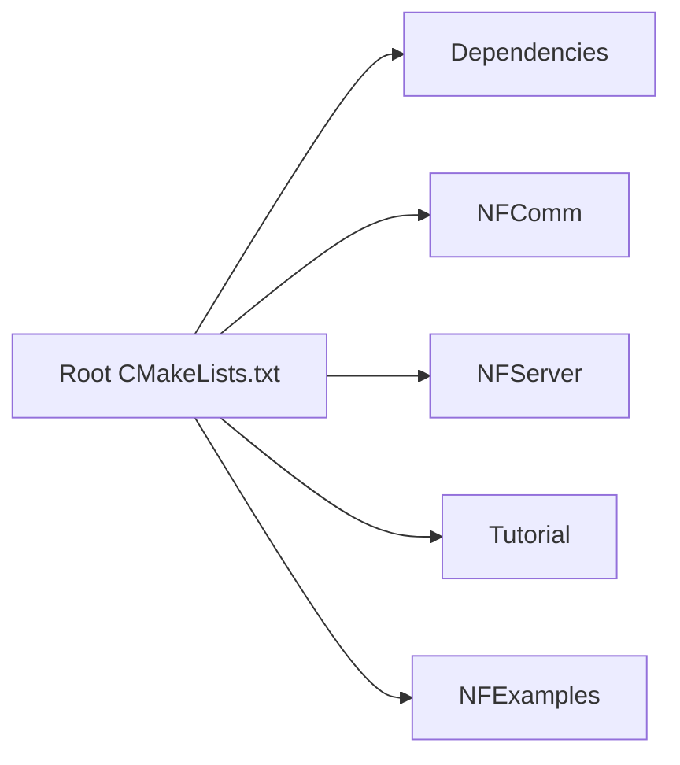
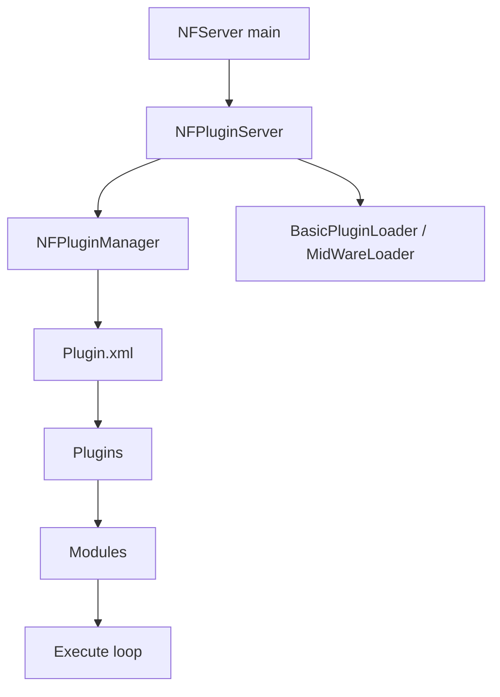

# NoahGameFrame 项目架构分析

## 1. 文档目的

本文档基于当前仓库源码、构建脚本与运行配置，对 `NoahGameFrame` 的架构设计做一次面向维护者和二次开发者的提炼。重点说明：

- 仓库是如何组织的
- 程序是如何被构建和启动的
- 插件和模块是如何装配、调度和隔离职责的
- 各类服务进程在运行时承担什么角色
- 扩展业务时应该优先沿着哪些边界演进

## 2. 项目定位

从 `README.md` 可以看出，`NoahGameFrame` 将自己定位为一个轻量、可扩展、分布式、面向插件的 C++ 框架，强调以下几个核心特征：

- 接口导向设计
- 插件化扩展
- 分布式服务器模型
- Actor 模型
- 事件驱动与属性驱动
- 跨平台构建与部署

这意味着它并不是一个将业务逻辑硬编码进单体进程的工程，而是一个以“框架层 + 插件层 + 进程角色层 + 配置层”组合起来的服务器框架。

## 3. 总体结论

从仓库结构和启动流程看，项目的核心设计可以概括为一句话：

**以 `NFPluginManager` 为运行时核心，以插件作为能力装配单元，以模块作为最小业务实现单元，以 XML 配置决定不同服务器角色加载哪些插件。**

换言之：

- 编译期通过 CMake 组织各类基础库、公共插件、服务器插件和示例插件
- 启动期通过 `NFServer` 创建一个或多个 `NFPluginServer`
- 每个 `NFPluginServer` 内部维护一个 `NFPluginManager`
- `NFPluginManager` 按 `Plugin.xml` 为当前进程角色选择插件集合
- 每个插件内部再注册若干 `NFIModule` 子模块
- 框架统一驱动模块生命周期和逐帧执行

## 4. 仓库结构

### 4.1 顶层目录职责

| 路径 | 作用 |
| --- | --- |
| `CMakeLists.txt` | 根构建入口，定义输出目录、全局 include、构建选项与子工程顺序 |
| `Dependencies/` | 第三方依赖和部分底层组件 |
| `NFComm/` | 公共框架层，包含核心库、插件接口、插件加载器以及通用能力插件 |
| `NFServer/` | 面向不同服务器角色的插件集合，如 `Game`、`Login`、`World`、`DB`、`Proxy`、`Master` |
| `NFExamples/` | 示例业务插件与示例服务器入口 |
| `Tutorial/` | 教学性质的模块/插件示例 |
| `NFTools/` | 工具链和辅助程序 |
| `_Out/` | 运行产物、配置文件、脚本与启动脚本 |
| `BuildScript/`、`docker/` | 构建脚本和部署辅助目录 |

### 4.2 分层视角

按职责可以进一步抽象为以下几层：

1. **基础层**
   `NFCore`、第三方依赖、通用数据结构、对象模型、基础工具。
2. **框架契约层**
   `NFIModule`、`NFIPlugin`、`NFIPluginManager` 以及各类 `NFI*Module` 接口。
3. **公共能力插件层**
   网络、日志、配置、脚本、NoSQL、安全、导航、Actor 等插件。
4. **服务器角色插件层**
   与 `GameServer`、`LoginServer`、`WorldServer`、`DBServer` 等角色对应的插件。
5. **业务示例层**
   `NFChatPlugin`、`NFInventoryPlugin`、`NFConsumeManagerPlugin` 以及 `Tutorial` 目录中的教程插件。
6. **运行配置层**
   `_Out/NFDataCfg` 下的 `Plugin.xml`、业务 XML、Lua 脚本等。

## 5. 构建架构

### 5.1 根 CMake 的组织方式

根目录 `CMakeLists.txt` 是整个工程的构建拓扑入口，主要完成：

- 定义工程名 `NoahFrame`
- 接入 `vcpkg.json` 对应的第三方依赖解析
- 根据 `Debug/Release` 设置 `_Out` 输出目录
- 配置不同平台下的 include 路径、编译参数和公共 target 规则
- 通过 `cmake/NoahBuild.cmake` 提供统一的目标配置辅助函数
- 提供 `link_NFSDK` 宏，统一链接 `NFCore`、`NFMessageDefine`、`NFNetPlugin`
- 通过 `add_subdirectory` 串联 `Dependencies`、`NFComm`、`NFServer`、`Tutorial`、`NFExamples`

当前推荐的构建入口不是旧脚本，而是根目录 `CMakePresets.json` 中的预设，例如：

- `windows-msvc-debug`
- `windows-msvc-release`
- `linux-debug`
- `linux-release`
- `macos-debug`
- `macos-release`

默认构建顺序如下：



这个顺序反映了很明确的依赖方向：

- 公共框架先于服务器角色构建
- 教程和示例建立在框架与服务器插件之上
- 根工程本身不承载业务，而是一个装配器
- 第三方依赖通过 `vcpkg + CMake` 在配置阶段完成装配

### 5.2 `NFComm` 与 `NFServer` 的角色

`NFComm/CMakeLists.txt` 聚合了通用插件与基础库，例如：

- `NFPluginLoader`
- `NFActorPlugin`
- `NFConfigPlugin`
- `NFCore`
- `NFKernelPlugin`
- `NFLogPlugin`
- `NFMessageDefine`
- `NFNetPlugin`
- `NFSecurityPlugin`
- `NFNavigationPlugin`
- `NFNoSqlPlugin`
- `NFLuaScriptPlugin`

`NFServer/CMakeLists.txt` 则聚合了服务器角色相关插件，例如：

- `NFGameServerPlugin`
- `NFLoginLogicPlugin`
- `NFMasterServerPlugin`
- `NFProxyLogicPlugin`
- `NFDBLogicPlugin`
- 以及各类 `*_Net_ClientPlugin`、`*_Net_ServerPlugin`、`*_HttpServerPlugin`

这说明项目在构建层面已经将“通用能力”和“分布式角色职责”做了清晰拆分。

### 5.3 `NFPluginLoader` 的特殊位置

`NFComm/NFPluginLoader/CMakeLists.txt` 将 `NFPluginLoader` 构建为一个静态库，并显式链接大量公共插件、服务器插件、示例插件和教程插件。

它的作用不是提供业务功能，而是作为一个“插件聚合宿主”：

- 让最终可执行程序能统一拿到全部可静态装配的插件
- 在非动态插件模式下，承担插件实例被创建和注册的桥梁

因此 `NFPluginLoader` 更像“框架宿主层”，而不是普通业务模块。

## 6. 运行时架构

### 6.1 主入口

默认主入口位于 `NFExamples/NFServer/NFServer.cpp`。

它有两种运行方式：

- **无参数启动**
  直接在一个进程中创建多个 `NFPluginServer` 实例，分别模拟 `MasterServer`、`WorldServer`、`LoginServer`、`DBServer`、`ProxyServer`、`GameServer`
- **带参数启动**
  根据命令行参数只启动一个指定角色的服务器实例

这说明：

- 项目既支持 IDE 下的一键本地联调
- 也支持按单角色独立部署

### 6.2 运行主循环

`NFServer.cpp` 中的主循环很简单：

1. 创建 `NFPluginServer`
2. 设置基础插件加载器和中间件加载器
3. 调用 `Init()`
4. 在循环中不断调用 `Execute()`
5. 退出时调用 `Final()`

其本质是把复杂性全部下沉到了插件管理系统中。

### 6.3 `NFPluginServer` 的职责

`NFComm/NFPluginLoader/NFPluginServer.cpp` 中，`NFPluginServer` 负责：

- 创建 `NFPluginManager`
- 解析命令行参数
- 设置配置路径和文件读取函数
- 调用外部传入的插件加载器
- 让插件管理器按固定生命周期运行

生命周期顺序如下：

```text
LoadPluginConfig
-> LoadPlugin
-> Awake
-> Init
-> AfterInit
-> CheckConfig
-> ReadyExecute
-> Execute
-> BeforeShut
-> Shut
-> Finalize
```

这套顺序贯穿插件和模块两个层级，是整个框架最关键的调度骨架。

### 6.4 `NFPluginManager` 的职责

从 `NFComm/NFPluginLoader/NFPluginManager.cpp` 可以看出，`NFPluginManager` 是运行时核心，承担以下职责：

- 保存当前应用名和实例 ID
- 维护插件名集合与插件实例集合
- 读取 `Plugin.xml`
- 按服务器角色筛选需要加载的插件
- 统一驱动插件生命周期
- 管理当前正在执行的插件与模块上下文

配置加载逻辑是：

- 先通过 `Server=...` 确定当前进程角色
- 再到 `Plugin.xml` 中查找同名节点
- 然后读取该节点下的 `<Plugin Name="..."/>`
- 最终加载对应插件

这意味着真正决定角色能力边界的不是可执行文件本身，而是运行时配置。

## 7. 插件与模块模型

### 7.1 模块：最小执行单元

`NFIModule` 是所有模块的共同基类，定义了完整生命周期：

- `Awake`
- `Init`
- `AfterInit`
- `CheckConfig`
- `ReadyExecute`
- `Execute`
- `BeforeShut`
- `Shut`
- `Finalize`
- `OnReloadPlugin`

这表明模块是框架中的最小调度单位，框架默认假设每个模块都可以被独立初始化、执行和关闭。

### 7.2 插件：模块的装配单元

`NFIPlugin` 继承自 `NFIModule`，但它额外承担一层职责：

- 提供 `Install()` 与 `Uninstall()`
- 内部维护自己注册的模块集合
- 在插件生命周期中顺序驱动这些模块

因此可以把两者关系理解为：

- **插件是装配容器**
- **模块是实际功能实现**

### 7.3 注册机制

`NFIPlugin.h` 中定义了几个关键宏：

- `CREATE_PLUGIN`
- `REGISTER_MODULE`
- `UNREGISTER_MODULE`

其中：

- `CREATE_PLUGIN` 负责创建插件对象并注册给 `NFIPluginManager`
- `REGISTER_MODULE` 负责将模块按接口类型加入插件管理器

这套设计的实际效果是：

- 业务代码依赖接口而不是具体实现
- 插件通过注册向框架暴露能力
- 其他模块通过 `FindModule` 获取依赖

它体现出明显的接口导向与服务定位器风格。

### 7.4 静态插件优先

当前仓库默认是静态插件模式：

- `NFPluginManager` 构造函数中默认 `mbStaticPlugin = true`
- `NFExamples/NFServer/NFServer.h` 中通过 `BasicPluginLoader` 和 `MidWareLoader` 显式调用 `CREATE_PLUGIN`

也就是说，项目虽然保留动态插件能力，但当前主路径更偏向“编译期聚合、运行期按配置启用”。

## 8. 运行时能力分层

### 8.1 公共能力插件

公共能力插件主要集中在 `NFComm/`，可以概括为：

| 插件 | 职责 |
| --- | --- |
| `NFNetPlugin` | 网络通信与传输基础设施 |
| `NFKernelPlugin` | 对象、属性、记录、场景等核心运行时能力 |
| `NFConfigPlugin` | 配置管理 |
| `NFLogPlugin` | 日志基础设施 |
| `NFLuaScriptPlugin` | Lua 脚本运行与热更相关能力 |
| `NFNoSqlPlugin` | NoSQL/Redis 等外部存储能力 |
| `NFSecurityPlugin` | 安全相关处理 |
| `NFNavigationPlugin` | 导航相关能力 |
| `NFActorPlugin` | Actor 模型和异步处理支持 |

这些插件不是面向某一个服务器角色，而是为多个角色复用的横切能力。

### 8.2 服务器角色插件

`NFServer/` 体现的是业务拓扑中的角色拆分，而不是简单的目录分类。

按名称可以看出以下角色：

- `MasterServer`
  管理和协调能力，通常承担注册、发现、调度入口等职责
- `WorldServer`
  世界级逻辑与跨服协调相关职责
- `LoginServer`
  账号登录与接入相关职责
- `ProxyServer`
  客户端接入与转发相关职责
- `GameServer`
  核心业务逻辑执行职责
- `DBServer`
  数据服务职责

此外，很多角色又细分为：

- 逻辑插件
- 对内客户端插件
- 对外服务端插件
- HTTP 服务插件

这种拆分方式说明项目将“角色职责”和“网络边界”一起纳入插件设计，而不是仅按业务领域分包。

### 8.3 示例业务插件

`NFExamples/` 中的：

- `NFChatPlugin`
- `NFInventoryPlugin`
- `NFConsumeManagerPlugin`

以及 `Tutorial/` 中的教程插件，都不是框架基础设施的一部分，而是对扩展方式的示范：

- 说明如何把业务能力装入插件
- 说明如何注册模块
- 说明如何挂接到框架生命周期

因此它们对理解“如何二次开发”非常重要。

## 9. 数据驱动、事件驱动与 Actor 模型

### 9.1 数据驱动内核

`NFIKernelModule` 暴露了大量围绕对象、属性、记录和场景的接口，例如：

- 创建/销毁对象
- 设置/获取属性
- 设置/获取记录表
- 注册属性回调
- 注册记录回调
- 注册类事件

这说明项目的核心业务模型并不是围绕传统的 ORM 或 Controller，而是围绕：

- 对象
- 属性
- Record
- Scene / Group

展开的内核式抽象。

### 9.2 事件驱动

`NFIEventModule` 提供了两类事件机制：

- 面向模块的事件
- 面向对象的事件

并支持公共事件回调注册。

这使得不同模块之间可以通过事件耦合，而不必直接形成大量显式依赖。

### 9.3 Actor 模型

`NFIActorModule` 提供：

- 申请和释放 Actor
- 给 Actor 发送消息
- 为消息注册结束回调
- 给 Actor 挂载组件

因此 Actor 在该框架里更像一套异步执行基础设施，用于把部分逻辑从同步主路径中拆出去。

## 10. 配置驱动的角色装配

### 10.1 `Plugin.xml` 的作用

`_Out/NFDataCfg/Debug/Plugin.xml` 按服务器角色定义插件清单，例如：

- `GameServer` 加载网络、内核、配置、日志、Lua、Actor、导航和业务示例插件
- `LoginServer` 加载登录逻辑、网络、DB 逻辑和 NoSQL
- `ProxyServer` 加载代理逻辑、安全、网络等插件
- `DBServer` 加载 DB 相关插件和 NoSQL

因此一个角色并不是通过不同的可执行文件来体现，而是通过：

- 同一套宿主框架
- 不同的 `Server=...`
- 不同的 XML 插件清单

组合出不同能力边界。

### 10.2 启动脚本体现的部署顺序

`_Out/rund.bat` 展示了典型本地启动顺序：

1. `MasterServer`
2. `WorldServer`
3. `LoginServer`
4. `DBServer`
5. `GameServer`
6. `ProxyServer`

这也从侧面说明：

- 系统存在控制面和业务面之分
- 某些角色需要先于其他角色就绪

## 11. 一条典型启动链路

下面是基于源码整理的一条典型链路：



如果换成一句更贴近工程实际的话，就是：

**入口程序创建宿主，宿主创建插件管理器，插件管理器根据角色配置启用插件，插件再注册模块，最终由统一主循环持续执行模块逻辑。**

## 12. 扩展设计建议

结合当前架构，新增功能时建议优先遵循下面的边界：

### 12.1 新增横切能力

如果功能会被多个服务器角色共享，例如：

- 新的基础服务
- 新的中间件适配
- 新的脚本能力
- 新的通用安全能力

优先放入 `NFComm/` 下的新插件。

### 12.2 新增角色业务能力

如果功能只属于某类服务器角色，例如：

- 仅登录服使用的认证逻辑
- 仅游戏服使用的玩法逻辑
- 仅代理服使用的接入规则

优先在 `NFServer/` 中以角色插件方式扩展。

### 12.3 新增业务样例或演示功能

如果目标是：

- 演示框架使用方式
- 提供最小闭环业务样例
- 快速验证某种架构模式

优先放入 `NFExamples/` 或 `Tutorial/`。

### 12.4 新增运行开关

如果希望某类能力可按部署环境切换，优先考虑：

- 保留插件实现
- 通过 `Plugin.xml` 决定是否启用

这比把开关硬编码到主程序更符合当前工程设计。

## 13. 架构特点总结

这个项目最值得把握的几个设计重点是：

1. **构建层和运行层分离**
   编译时聚合能力，运行时按角色配置启用能力。
2. **插件是装配边界，模块是执行边界**
   插件组织能力，模块承载具体逻辑。
3. **同一宿主支撑多种服务器角色**
   角色差异主要通过 XML 配置和插件集体现。
4. **核心内核偏数据驱动**
   对象、属性、Record、Scene 是基础抽象。
5. **事件与 Actor 提供解耦和异步能力**
   适合承载复杂在线业务。
6. **示例与教程直接嵌入主工程**
   降低了理解和扩展门槛。

## 14. 当前仓库中的注意点

在分析过程中，有一个值得记录的现象：

- `Plugin.xml` 中出现了 `NFWorldLogicPlugin`
- 当前仓库中未检索到对应源码目录或构建项

这可能意味着：

- 该插件是历史遗留配置
- 该插件位于当前仓库之外
- 当前配置与源码存在轻微漂移

因此在后续做启动排查或裁剪部署时，建议把“源码中的插件集合”和“XML 中声明的插件集合”做一次专项对齐。

## 15. 建议的阅读顺序

如果后续要继续深入这个项目，推荐按以下顺序阅读源码：

1. `README.md`
2. `CMakeLists.txt`
3. `NFExamples/NFServer/NFServer.cpp`
4. `NFExamples/NFServer/NFServer.h`
5. `NFComm/NFPluginLoader/NFPluginServer.cpp`
6. `NFComm/NFPluginLoader/NFPluginManager.cpp`
7. `NFComm/NFPluginModule/NFIModule.h`
8. `NFComm/NFPluginModule/NFIPlugin.h`
9. `NFComm/NFPluginModule/NFIKernelModule.h`
10. `NFComm/NFPluginModule/NFIEventModule.h`
11. `NFComm/NFPluginModule/NFIActorModule.h`
12. `_Out/NFDataCfg/Debug/Plugin.xml`

按这个路径阅读，会先理解宿主和生命周期，再理解插件/模块接口，最后回到角色配置和业务插件，成本最低。
